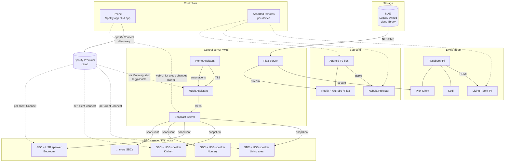
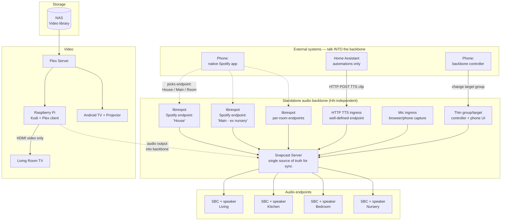

# Architecture Diagrams — Current & Proposed

Captured: 2026-04-18

Diagrams are public-safe — no real IPs or hostnames. Topology only.

## Guiding preference (applies to all "proposed" diagrams below)

**Home Assistant is not the integration backbone.** HA has useful automations but tends to introduce brittleness at the integration surface — this is the single strongest lesson from the current setup's pain points. Any proposed architecture treats the media/audio backbone as a **standalone system that HA talks *into*** (e.g. pushing a TTS clip to a well-defined endpoint), never one HA owns or glues together.

## Current architecture

### Pain points visible in the diagram

- **Two parallel paths into the speakers** — native Spotify Connect direct to each SBC, *and* Music Assistant → Snapcast. These collide when used together, and the glue to prevent collision is custom scripting.
- **Music Assistant is load-bearing** for Spotify, TTS, and automations — it's also the laggy/brittle component.
- **Home Assistant sits mid-path** for TTS and automations, pulling itself into the integration surface.
- **Group changes require the Snapcast web UI** — no low-friction path from phone to "play on Main" vs "play on House".
- **TV audio never touches the mesh** — Kodi/Plex clients on the Pi ship sound out the local DAC/HDMI; the multi-room infrastructure is wasted when watching video.
- **Controllers proliferate** — each TV/projector/box has its own remote.

## Proposed architecture — sketch (HA kept at arm's length)

This is a *sketch*, not a decision. It illustrates what a simplified topology could look like given the documented pain points and the "HA is not the backbone" rule. Options are still open per `audio-layer-options.md`.

### What changes vs today

- **Music Assistant removed from the hot path.** Its jobs (Spotify bridging, TTS routing, group management) are split into three tiny, purpose-built components behind Snapcast.
- **Named groups are first-class Spotify endpoints.** "House" and "Main" appear in the native Spotify app as selectable speakers — no web UI detour to re-assign clients.
- **HA is a caller, not a core.** HA posts TTS clips to a defined ingress and invokes nothing else. If HA is down, music still works; if the backbone is down, HA automations that don't need sound still work.
- **Video clients can output into the backbone.** Kodi on the Pi can (optionally) route audio to Snapcast instead of the TV's speakers, so multi-room finally applies to movie nights.
- **Intercom/PA uses the same ingress pattern** — a mic-capture source posts to the backbone; it's not a separate streaming stack.
- **One controller UI** for target-group changes, reachable from the phone.

### What this sketch deliberately does *not* decide

- Whether `librespot` is the right Spotify bridge (vs e.g. `go-librespot`, `spotifyd`, or a fundamentally different approach).
- How many SBCs/endpoints exist and what's in each room — that inventory is still outstanding.
- Whether the nursery is excluded from "Main" by device ID, room tag, or a separate stream — to be resolved when the inventory is done.
- Collision/priority policy (what happens when TTS fires during movie audio, or an intercom call during music).
- Whether the Raspberry Pi stays (Kodi + Plex) or the living-room client is simplified.

### What the sketch preserves by design

- HA stays useful for everything it's genuinely good at (automations, scenes, non-audio integrations) — it just doesn't own the audio path.
- Plex and the NAS are unchanged; video architecture is untouched in this pass.
- Snapcast stays as the sync primitive — the changes are around *what feeds it* and *how groups are selected*, not the mesh itself.

## Next

- Fill in the room/speaker inventory so the proposed endpoint list (`House`, `Main`, per-room) can be made concrete.
- Decide the nursery-exclusion rule.
- Only then: evaluate the specific options in `audio-layer-options.md` against this sketched topology.
